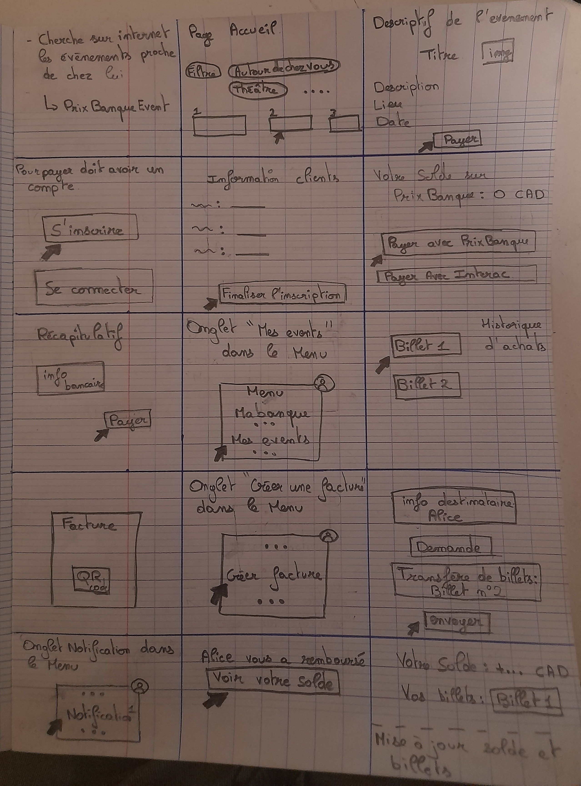

# PrixBanque Projet - Cours 8INF853

## **Participants du projet**

- **Dylan Fournier** 
- **Maxime Blanchard** 
- **Semah Bahroun** 

## **Résumé de l'application**

L'application bancaire est spécialement conçue pour faciliter la vente de billets d'événements proposés par des organisations, associations et autres. Les utilisateurs peuvent créer un compte bancaire, réserver et acheter des billets pour des événements, consulter leurs billets achetés, et demander des paiements à d'autres utilisateurs de l'application. Cette solution combine la gestion des événements et des transactions bancaires dans une seule interface pratique et sécurisée.

---

## **Design Sprint Template Miro**


Vous pouvez explorer notre template Miro pour découvrir toutes les étapes réalisées lors de notre Design Sprint :

[Accéder au template Miro](https://miro.com/app/board/uXjVKg5I5AM=/)

---

## **Storyboard**

Voici une représentation visuelle du storyboard que nous avons créé lors de notre Design Sprint.



---

## **Prototype**

Le prototype que nous avons conçu lors de notre session de design sprint a été réalisé à l'aide de Figma. Vous pouvez le consulter en cliquant sur le lien suivant : [Accéder au prototype](https://www.figma.com/proto/dREpwMjmqfHkZRedR2JI6P/Prototype-8INF853?node-id=0-1&t=jwHDESuVL3NaPOKF-1)

---

## **Architecture**

L'architecture de cette application repose sur un modèle microservices, conçu pour garantir modularité, scalabilité et maintenabilité. Elle est documentée en détail dans le rapport d'architecture et est disponible ici : . 
Ce document présente les choix architecturaux, les diagrammes UML, les services principaux, et la gestion de la base de données.

---

## Instructions d'utilisation

### 1. Prérequis

- Assurez-vous que Java JDK 17 ou une version ultérieure est installée sur votre machine.
- Installez Maven pour gérer les dépendances des microservices.
- Vérifiez que MySQL est install´e et configur´e pour accueillir les bases de données nécessaires
- Assurez-vous que Node.js et npm sont installés sur votre machine

### 2. Installation

1. Clonez le dépôt Git sur votre machine locale :
   
```git clone https://github.com/DidouLaMenace/project_course_8INF853.git```

2. Accédez au répertoire du projet :

```cd project_course_8INF853```

3. Rendez-vous dans le dossier contenant le frontend de l’application :
   
```cd front-end```

5. Installez les dépendances nécessaires avec npm :

```npm install```

### 3. Exécution

Sur un ordinateur Windows, il est possible d'exécuter le script `start-all.bat` pour lancer tous les microservices, le discovery server, l'API gateway ainsi que le front-end.

Pour lancer le projet manuellement:
- pour le backend, il faut se déplacer dans chaque sous-répertoire de */back-end* et lancer l'application avec Maven. Par exemple, pour le discovery server:

```
cd back-end\discovery-server
mvnw spring-boot:run
```

- pour le backend, il faut se déplacer dans le sous-répertoire */front-end* et lancer l'application web avec npm:

```
cd front-end
npm start
```

---

## Guide d'utilisation
[Regarder la vidéo de démonstration](https://youtu.be/19DNwwrKKgM) pour en savoir plus sur le fonctionnement du projet.

---

## Test de montée en charge (preuve de concept)

> [Regarder la vidéo](https://youtu.be/L_o4C61UN7U) pour voir les résultats de notre test

Nous avons utilisé [Artillery](https://github.com/artilleryio/artillery) pour tester les capacités de l'API.
Pour reproduire le test, installez Artillery sur votre ordinateur (`npm install -g artillery`), puis lancer un test en utilisant le fichier yml de configuration à la racine du dépôt :

```artillery run reservationLoadTest.yml```
