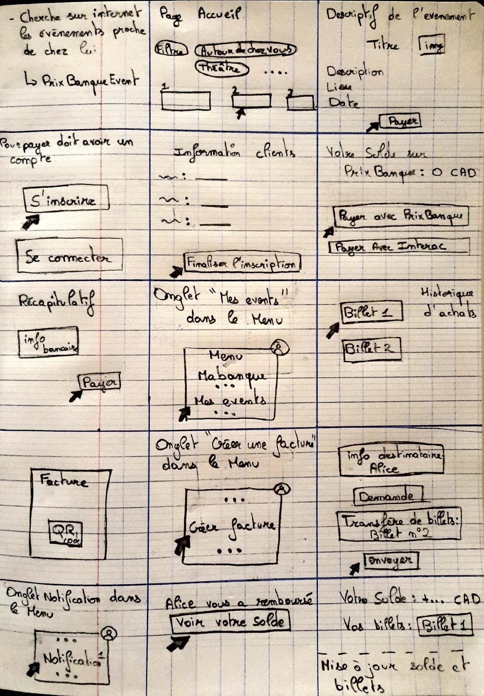

# ** PrixBanque Projet - Cours 8INF853**

## **Participants du projet**

- **Dylan Fournier** 
- **Maxime Blanchard** 
- **Semah Bahroun** 

## **Résumé de l'application**

L'application bancaire est spécialement conçue pour faciliter la vente de billets d'événements proposés par des organisations, associations et autres. Les utilisateurs peuvent créer un compte bancaire, réserver et acheter des billets pour des événements, consulter leurs billets achetés, et demander des paiements à d'autres utilisateurs de l'application. Cette solution combine la gestion des événements et des transactions bancaires dans une seule interface pratique et sécurisée.

---

## **Design Sprint Template Miro**

Vous pouvez explorer notre template Miro pour découvrir toutes les étapes réalisées lors de notre Design Sprint :

[Accéder au template Miro](https://miro.com/app/board/uXjVKg5I5AM=/)

---

## **Storyboard**

Voici une représentation visuelle du storyboard que nous avons créé lors de notre Design Sprint.

---

